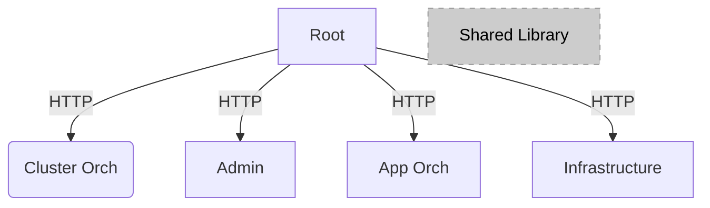

# Orchestrator GUI Web User Interface

## Overview

This implements the web user interface for the Orchestrator,
allowing the user to perform most of the product's features in an intuitive,
visual manner without having to learn all the complexities of the APIs.
That being said, everything the Web UI does and shows comes from the APIs.
This UI is intended for day-to-day edge operators, who want to be able to:

- Register, Onboard and Provision hosts
- Create and manage Clusters
- Create and manage Projects
- Create Deployment Packages
- Deploy and manage Deployments
- Create applications and view and edit them in a catalog
- Schedule maintenance windows
- View alerts
- View the state of the system
- View Cluster templates and import new templates

Read more about Edge Orchestrator in the [User Guide](https://docs.openedgeplatform.intel.com/edge-manage-docs/main/user_guide/index.html).

## Get Started

See the [Documentation](https://docs.openedgeplatform.intel.com/edge-manage-docs/main/user_guide/get_started_guide/index.html) to get started using Edge Orchestrator.

## Develop

To develop Edge Orchestrator, the following development prerequisites are required:

- Node.js (LTS version recommended)
- npm (comes with Node.js)
- Modern web browser (Chrome, Firefox, Edge)
- Access to the Edge Orchestrator API endpoints
- Code editor (VS Code recommended)

This project is a "mono-repo" example of micro front ends (MFEs), with minimal amount of configuration per project.

> Note that MFEs and libraries are being moved to independent repost

There are 5 apps in this repository:

- root - Glues everything together, displays the other apps
- app-orch - Manages the Application Catalog and Deployments
- cluster-orch - Manages the Clusters
- infra - Manages the Hosts (Edge Infrastructure)
- admin - The administrator features (settings and alerts)

In addition, there is a common library that is shared across all apps.

(Note: All sub-projects are React based)



### Development Workflow

1. Install dependencies:
   ```
   npm install
   ```

2. Start the development environment:
   ```
   npm run start
   ```
   This will concurrently run all MFEs. The root application will be available at http://localhost:8080, which provides navigation to all other MFEs.

### Running with mock data
If you would like to see data without connecting to real API's you can enable the mock server by setting the `REACT_LP_MOCK_API` environment variable value to `true`

Set this value BEFORE you run the `npm run start`. 

### Testing

- Run component tests (with Cypress):
  ```
  npm run tests:component
  ```
- Run end-to-end tests (with Cypress):
  ```
  npm run tests:e2e
  ```

### Building the application

- Build all applications:
  ```
  npm run app:admin:build
  npm run app:infra:build
  npm run app:app-orch:build
  npm run app:root:build
  npm run app:cluster-orch:build
  ```
- Or build individual applications as needed using the specific build scripts

### Project Structure

The project uses Webpack for bundling, TypeScript for type safety, and Cypress for testing. The application is separated into multiple micro front-ends that can be developed, tested independently.

## Contribute

To learn how to contribute to the project, see the [Contributor's Guide](https://docs.openedgeplatform.intel.com/edge-manage-docs/main/developer_guide/contributor_guide/index.html).

## Community and Support

To learn more about the project, its community, and governance, visit the [Edge Orchestrator
Community](https://github.com/open-edge-platform).

For support, start with [Troubleshooting](https://docs.openedgeplatform.intel.com/edge-manage-docs/main/user_guide/troubleshooting/index.html) or [contact us](https://github.com/open-edge-platform).

## License

Orchestrator GUI Web User Interface is licensed under [Apache 2.0 License](LICENSES/Apache-2.0.txt).

Last Updated Date: April 03, 2025