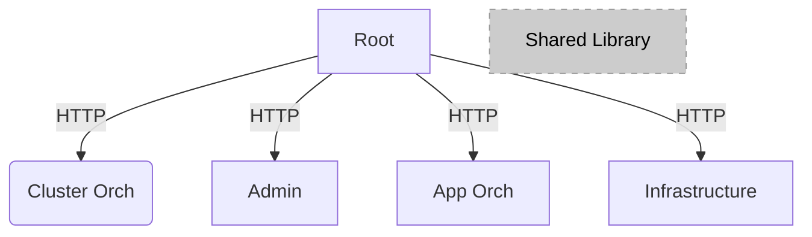

# Orchestrator GUI Web User Interface

## Overview

This implements the web user interface for the Orchestrator, allowing the user to do most of the features of the product in an intuitive, visual, manor without having learn all the complexities of the APIs.  That being said, everything the Web UI does and shows comes from the APIs.  This UI is intended for the day to day edge operators, who want to be able to:
- Register, Onboard and Provision hosts
- Create and manage Clusters
- Create and manage Projects
- Create Deployment Packages
- Deploy and manage Deployments
- Create applications and view and edit them in a catalog
- Schedule maintenance windows
- View alerts
- View the state of the system
- View Cluster templates and import new templates

## Get Started

## Edge Orchestrator Mirco Front Ends

This project is a "mono-repo" example of micro front ends (MFEs), with minimal amount of configuration per project.

> Note that MFEs and libraries are being moved to independent repost

There are 5 apps in this repository:

- root - glues everything together, displays the other apps
- app-orch - Manages Application Catalog and Deployments
- cluster-orch - Manages the Clusters
- infra - Manages the Hosts (Edge Infratructure)
- admin - The administrator features (settings and alerts)

In addition, there is a common library that is shared across all apps.

(Note: All sub-projects are React based)


## Build the docker images

A `Makefile` is provided to build the docker images.
You can build the images individually with:

```shell
DOCKER_TAG=dev make -C apps/root docker-build
DOCKER_TAG=dev make -C apps/infra docker-build
DOCKER_TAG=dev make -C apps/cluster-orch docker-build
DOCKER_TAG=dev make -C apps/app-orch docker-build
```

or alternatively you can build all of them with:

```shell
DOCKER_TAG=dev make docker-build-all
```

> NOTE that this requires that your development environment is correctly setup with all the required dependencies in place


Read more about {Name} in the \[User
Guide\](<https://website-name.com>).


See the \[Documentation\](<https://website-name.com>) to get started
using {Name}.

## The TLDR on deploying Edge Orchestrator UI in kubernetes

```shell
helm repo add lp https://amr-registry.caas.intel.com/chartrepo/one-intel-edge/ --username "**"  --password "**"
helm upgrade --install --create-namespace -n orch-ui orch-ui apps/root/deploy
```

## License

{Project Name} is licensed under \[license
name\](https://website-name.com).

Last Updated Date: {January 17, 2025}
