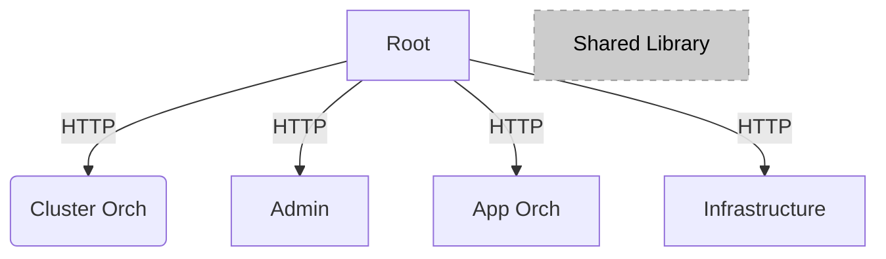

<!---
  SPDX-FileCopyrightText: (C) 2022 Intel Corporation
  SPDX-License-Identifier: Apache-2.0
-->

# Orchestrator GUI Web User Interface

[](https://opensource.org/licenses/Apache-2.0)
[](https://scorecard.dev/viewer/?uri=github.com/open-edge-platform/orch-ui)

## Overview

This implements the web user interface for the Orchestrator,
allowing the user to do most of the features of the product in an
intuitive, visual, manner without having learn all the complexities
of the APIs. That being said, everything the Web UI does and shows
comes from the APIs. This UI is intended for the day to day edge
operators, who want to be able to:

- Register, Onboard and Provision hosts
- Create and manage Clusters
- Create and manage Projects
- Create Deployment Packages
- Deploy and manage Deployments
- Create applications and view and edit them in a catalog
- Schedule maintenance windows
- View alerts
- View the state of the system
- View Cluster templates and import new templates

Read more about Edge Orchestrator in the [User Guide](https://docs.openedgeplatform.intel.com/edge-manage-docs/main/user_guide/index.html).

## Get Started

### Edge Orchestrator Micro Front Ends

This project is a "mono-repo" example of micro front ends (MFEs),
with a minimal amount of configuration per project.

> Note that MFEs and libraries are being moved to independent repositories.

There are 5 apps in this repository:

- root - Glues everything together, displays the other apps
- app-orch - Manages the Application Catalog and Deployments
- cluster-orch - Manages the Clusters
- infra - Manages the Hosts (Edge Infrastructure)
- admin - The administrator features (settings and alerts)

In addition, there is a common library that is shared across all apps.

(Note: All sub-projects are React-based)


```mermaid
graph TD
    linkStyle default interpolate basis
    A[Root]

    A -->|HTTP| B(Cluster Orch)
    A -->|HTTP| D[Admin]
    A -->|HTTP| E[App Orch]
    A -->|HTTP| F[Infrastructure]
    G[Shared Library]

    style G fill:#ccc,stroke:#999,stroke-width:1px,color:#000,stroke-dasharray: 5 5
```

## Develop

### Prerequisites and Setup

Before developing UI related features or tests in Orchestrator GUI Web User Interface, following development prerequisites are required:

- [Node JS](https://nodejs.org/en/download)

  ```bash
  node -v
  v23.6.0
  ```

- To install [Node JS dependencies](https://www.npmjs.com/) for Orchestrator GUI Web User Interface, execute following command at base folder of repo:

  ```bash
  npm ci
  ```

The code for UI is written in [React](https://react.dev/). The React component code follows the pattern by taking the reference from [Atomic Design](https://atomicdesign.bradfrost.com/chapter-2/).

The project uses Webpack for bundling, TypeScript for type safety, and Cypress for testing.
The application is separated into multiple micro front-ends that can be developed, tested independently.

- To run development server execute following command at base folder of repo:

  ```bash
  npm run app:<mfe-app-name> # <mfe-app-name> can be app-orch, cluster-orch, root, admin and infra.
  ```

> Note: `<mfe-app-name>` can be app-orch, cluster-orch, root, admin and infra.

- To run all MFEs concurrently:

  ```bash
  npm run start
  ```

  This will concurrently run all MFEs. The root application will be available at http://localhost:8080, which provides navigation to all other MFEs.

- To build MFEs:

  ```bash
  npm run app:<mfe-app-name>:build # <mfe-app-name> can be app-orch, cluster-orch, root, admin and infra.
  ```

### Running with mock data

If you would like to see data without connecting to real API's you can enable the mock server by setting the `REACT_MOCK_API` environment variable value to `true`

Set this value BEFORE you run the `npm run start`.

### Running the local UI against a remote Edge Orchestrator cluster

The dev server defaults to mock data (or to the `kind.internal` FQDN baked into
each app's `public/runtime-config.js`). To point your localhost UI at a real
cluster two things are required:

1. Tell the UI where the cluster lives, and
2. Tell the cluster's gateway to accept browser requests from your laptop's
   origin (CORS).

#### 1. Point the UI at the cluster

Edit the `fqdn` constant of each
`apps/<mfe>/public/runtime-config.js` you intend to run (at minimum the one
for `root`, which serves `http://localhost:8080`):

```js
// Replace "kind.internal" with your cluster's domain.
const fqdn = "your-cluster.example.com";
```

This rewrites every derived URL — `https://api.<fqdn>`, `https://keycloak.<fqdn>`,
`https://web-ui.<fqdn>`, etc. — to your cluster.

Then start the dev server (mock mode off):

```bash
unset REACT_MOCK_API
npm run start
```

The UI is served at <http://localhost:8080> and will call
`https://api.<your-cluster>/v1/...` from the browser.

#### 2. Allow your machine origin through CORS on the cluster

Because the UI (`http://localhost:8080`) and the API
(`https://api.<your-cluster>`) are different origins, the browser issues a
CORS preflight on every API call. The cluster's Traefik `cors` middleware
only allows the cluster's own public origins by default; your local machine must be
added explicitly.

If your cluster was deployed with
[`edge-out-of-band-manageability`](https://github.com/open-edge-platform/edge-out-of-band-manageability),
extra CORS origins are an explicit opt-in (default off). Set
**both** flags below and re-sync the `traefik-extra-objects` release:

```bash
cd <path-to>/edge-out-of-band-manageability/post-orch

# Load the cluster's standard env vars (EOM_CLUSTER_DOMAIN, etc.)
set -a; source post-orch.env; set +a

# Opt in to extra CORS origins (default is false).
export EOM_CORS_ALLOW_EXTRA_ORIGINS=true

# Add your dev origin(s).
export EOM_CORS_EXTRA_ORIGINS="http://localhost:8080"

# Reconcile only the gateway/CORS chart.
helmfile -e onprem-eim sync --selector app=traefik-extra-objects
```

You can verify the change (the exact `Middleware` name and namespace come from
the `traefik-extra-objects` chart in your cluster — adjust if your deploy
overrides them):

```bash
kubectl get middleware.traefik.io -A \
  -o jsonpath='{range .items[*]}{.metadata.namespace}/{.metadata.name}: {.spec.headers.accessControlAllowOriginList}{"\n"}{end}' \
  | grep -i cors
```

`http://localhost:8080` should appear alongside the cluster's public origins.
After this, hard-reload the UI (browsers cache failed preflights) and the API
calls will succeed.

> The two cluster public origins (`https://<EOM_CLUSTER_DOMAIN>` and
> `https://web-ui.<EOM_CLUSTER_DOMAIN>`) are injected automatically from
> `EOM_CLUSTER_DOMAIN` — only **extra** dev origins go in
> `EOM_CORS_EXTRA_ORIGINS`.

### Testing

The test codes are written with Cypress. To test Orchestrator GUI Web User Interface,

```bash
cd tests/<mfe-app-name> # change current working directory to `mfe testing folder within tests folder`
npx cypress open # [--component <component|e2e> --spec ../../apps/<mfe-app-name>/src/components/<path-to-test-files>]

# Alternatively to `cypress open` (for GUI), you can also run cypress with CLI using below command
npx cypress run # [--component <component|e2e> --spec ../../apps/<mfe-app-name>/src/components/<path-to-test-files>]
```

For testing your changes in a virtual machine with deployment, refer to [Build and Deploy Guide](./docs/build.md) documentation.

## Contribute

We welcome contributions from the community! To contribute, please open a pull request to have your changes reviewed and merged into the `main` branch. We encourage you to add appropriate unit tests and end-to-end tests if your contribution introduces a new feature.
To learn how to contribute to the project, see the [Contributor's Guide](https://docs.openedgeplatform.intel.com/edge-manage-docs/main/developer_guide/contributor_guide/index.html).

## Community and Support

To learn more about the project, its community, and governance, visit
the [Edge Orchestrator Community].

For support, start with [Troubleshooting] or [Contact us].

## License

Orchestrator GUI Web User Interface is licensed under [Apache-2.0](./LICENSES/Apache-2.0.txt).

Last Updated Date: April 7, 2025

[Troubleshooting]: https://docs.openedgeplatform.intel.com/edge-manage-docs/main/developer_guide/troubleshooting/ui.html
[Contact us]: https://github.com/open-edge-platform
[Edge Orchestrator Community]: https://docs.openedgeplatform.intel.com/edge-manage-docs/main/index.html
