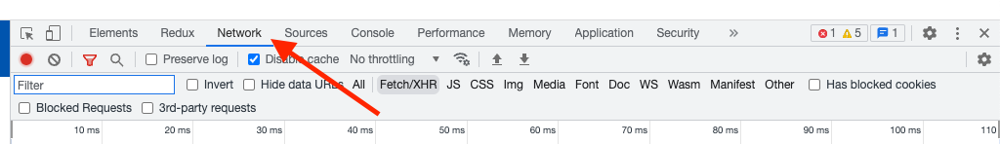
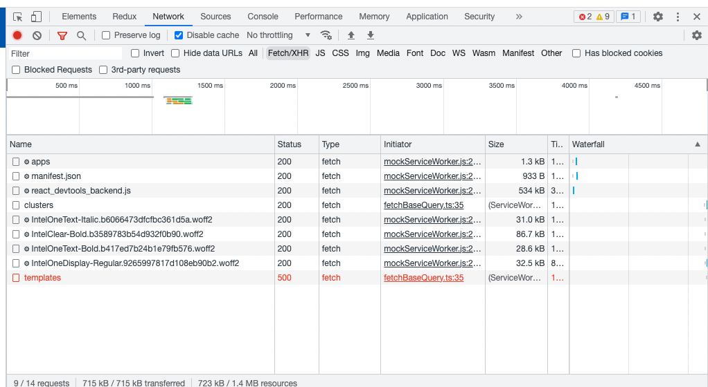
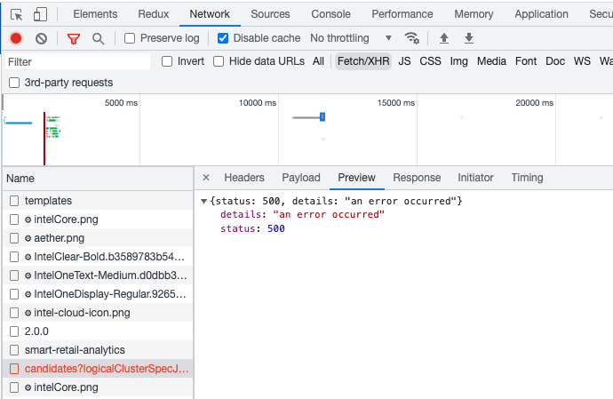
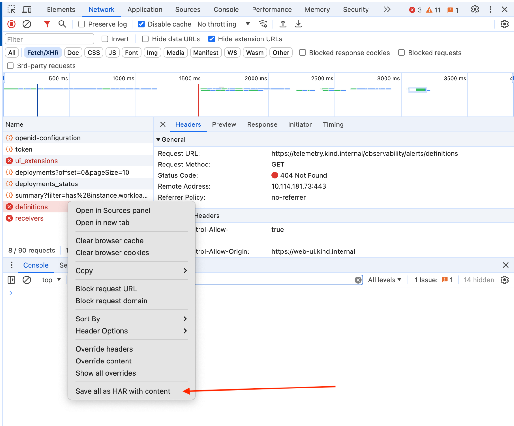
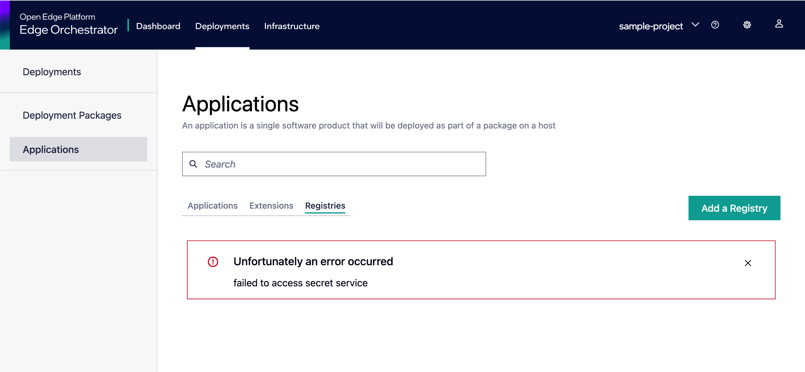

# Troubleshooting UI issues

The Orchestrator UI is a single page application that is completely stateless and relies on data provided via a REST API to populate it's content.
For this reason it is always import to keep track of the API responses in conjuction to what is displayed in the UI.

## How to check the API calls that the UI is making and the corresponding responses

You can follow this guide to see the requests and responses that the UI sends and receives.

1.  Open the browser console
    - Note that in order to capture requests the console need to be open before the request is sent
    - To do that right-click anywhere on the page, and click “Inspect” (note that different browsers will have small variations, eg “Inspect Element”). The common shortcut to open the console is Cmd + Alt + J (Google Chrome on Mac)
1. In the top Menu of the console select “Network”
    - You can filter the request for “Fetch/XHR” as all the API interactions will be in that category
    - If you are looking for a specific object and you know the ID (eg: a deployment) you can also use the text-box to filter only the request that have that ID in the URL
    
1. Find the failed request
    - They are generally highlighted in red
    
1. Click on the failed request
    - This opens a new tab that lets you see all the details of such request
    
1. Where to find information:
    - Headers -> contains the URL, the REST Headers and other generic information
    - Payload -> contains the data sent to the server
    - Preview -> A formatted representation of the response
    - Response -> The plain response
1. Export the entire request:
    - Right click on the request you want to export and the then select “Save all as HAR” (the text might be slightly different depending on the browser)
    

## Known issues and solutions

The following is a list of known issues that occasionally appear in the UI during development and the best known solution. This is not intended to address issues in productions, as those should be treated as bugs and fixed.

### Application registries cannot be fetched

This happens when Vault is sealed in your setup.

**Solution**: `mage vault:unseal`